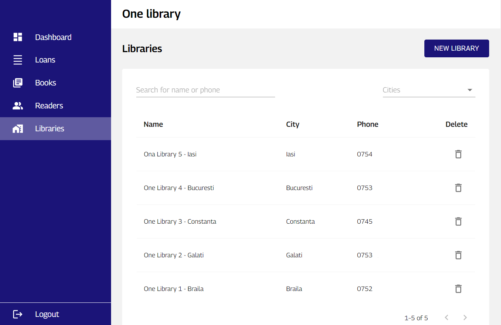
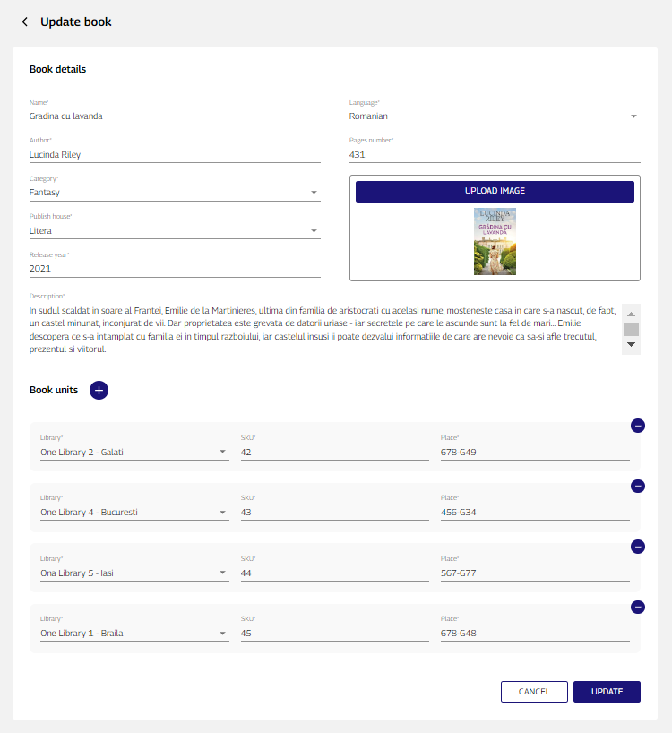
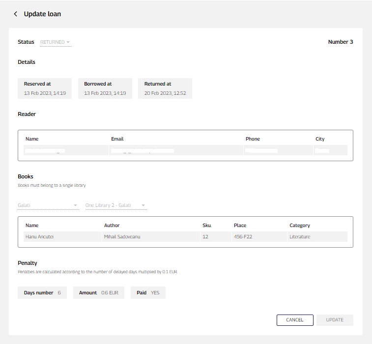
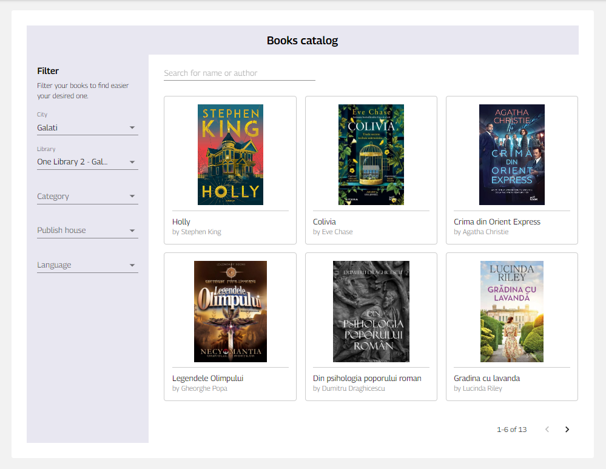
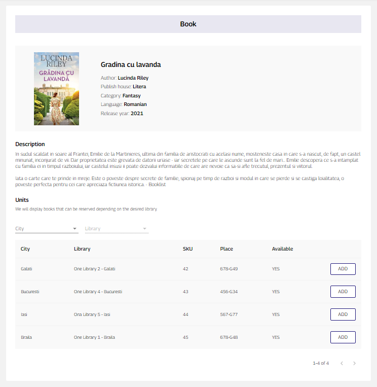
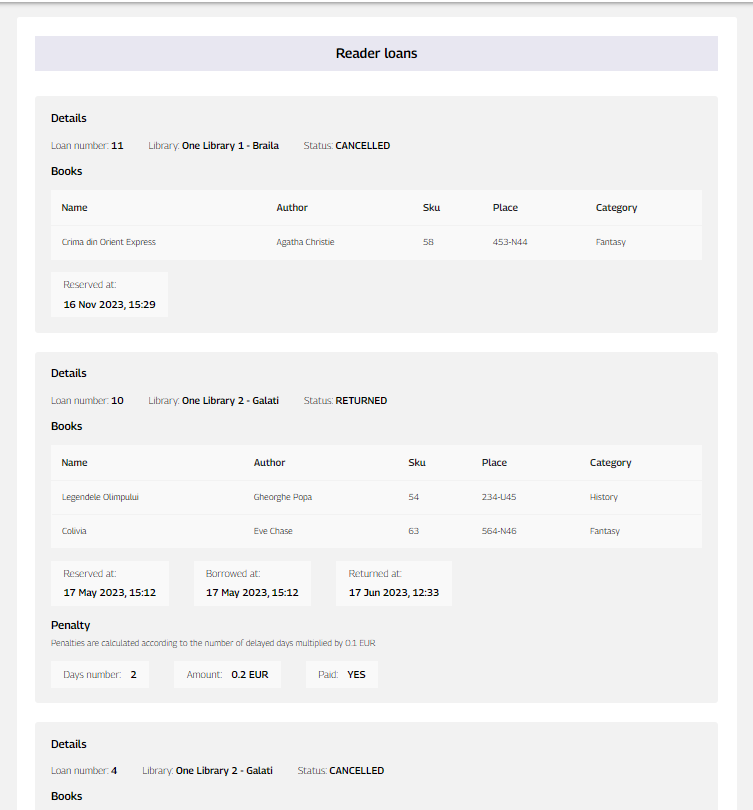

# Library Management System

## Description
This project is a Library Management System built using modern web development technologies:

  - ReactJS
  - Typescript
  - RemixJS
  - Style-components
  - Prisma
  - MongoDB
  - Turborepo

## Applications

### 1. Library Admin Interface (app/admin)

Description: The Admin Interface application is designed for library administrators. It provides functionalities to manage the library's catalog, library's branches,
manage borrowed books and readers accounts.

Key Features:

  - Dashboard for an overview of library statistics.
  - CRUD operations for books, reader accounts, library branches .
  - Borrowing history and posibility to create/update one having 4 statuses: RESERVED, BORROWEB, RETURNED, CANCELLED.
  - Cron job for overdue book loans.
  - Logial deletion on library branches, readers and books.
  - Responsive design.

### 2. Library Readers Interface (app/library)

Description: The Readers Interface application is a user-friendly portal for library readers. It allows users to search for books, borrow them, read summaries, and manage their borrowings.

Key Features:

  - Book search and browsing functionality.
  - Detailed book information and summaries.
  - User account management.
  - Borrowing and return tracking.
  - Librarie's branches contact.

